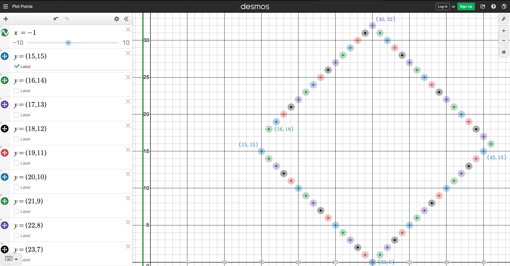
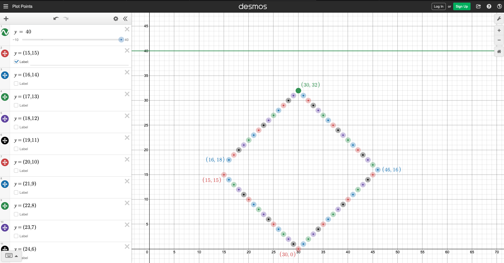

# ShortestDistancePolygonToLine
Data Structure 2 Assignment 5 by @iamgauravsatija
Gaurav Satija 

## Pseudocode

I am using binary search approach to find the shortest distance between polygon and a line

<b>main method to set values of variables:</b>

* This method calls binarySearch() 
```
let number of vertices be n
line be give by: ax + by = c
Pick three vertices:
    left_vertex - index 0
    mid_vertex - index n/2
    right_vertex - index n

Find distance of left_vertex, mid_vertex and right_vertex from line. 
Let they be called dist_left, dist_mid and dist_right respectively.

call binarySearch(left_vertex, mid_vertex, right_vertex)
```


<b>Binary Search Method: Recursion</b>

```
binarySearch(left_vertex, middle_vertex, right_vertex)
    if all three distance are not equal:
        return vertex 

    if dist_left < dist_right:
        new_index = (left_vertex.getIndex() + middle_vertex.getIndex())/ 2
        new_vertex = vertex_list[new_index]
        return binarySearch(left_vertex, new_ver, middle_vertex)
    
    elif dist_right < dist_left:
        new_index = ((right_vertex.getIndex() + middle_vertex.getIndex())/ 2) + 1
        new_vertex = vertex_list[new_index]
        return binarySearch(middle_vertex, new_ver, right_vertex)
```
<br>

## Python Code:<br>
The python file can be found in same folder as README.md with the name <b><u>shortstDistance.py</b></u>

### <b>Instructions:</b> 
<br>

* Open the file and go to line 81
> filename = "input.txt"  # Change the input file path here
change the file name to either input.txt or input2.txt

* Open Terminal, navigate to the folder with this python file and enter following command:
>  python3 shortstDistance.py

<b>Sample Output 1:</b> <br>
For the below output file "input.txt" file.

```
======================================================

Input file name:  input.txt
Number of Vertices:  62
Closest Point on Polygon to Line:    X- 15 , Y- 15
Distance to the Polygon:  16

======================================================
```


<b>Sample Output 2:</b> <br>
For the below output file "input2.txt" file.
```

======================================================

Input file name:  input2.txt
Number of Vertices:  62
Closest Point on Polygon to Line:    X- 30 , Y- 32
Distance to the Polygon:  8

======================================================

```

<br>
<br>


## Part 3: 2 Examples

The folder also contains input.txt and input2.txt file which contains sample input data that can be used to test the python file.
These examples satisfies the reuirements as no matter which ever part is picked (left-mid or right-mid) it will have 30 vertices including (mid and other one) in the "sunny-side"

Moreover, you can see below their corresponding graphical reprsentation. Also you can go online using the link below the image to see a dynamic graphical reprsentation

input.txt

https://www.desmos.com/calculator/va5dfpdf44

<br>

input2.txt

https://www.desmos.com/calculator/mhq4hsncnh

Note: createPoints.py was used to create list of verticies.